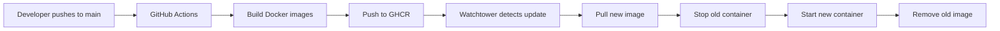

# Production Deployment Guide

## Quick Start

### 1. Pull Latest Images from GHCR

```bash
docker compose -f docker-compose.prod.yml pull
```

### 2. Start Services

```bash
docker compose -f docker-compose.prod.yml up -d
```

### 3. Check Watchtower Logs

```bash
docker logs -f freeradical_watchtower
```

## Key Differences from Development

### Development (docker-compose.yml)
- ❌ Builds images locally with `build: .`
- ❌ Watchtower can't update (no registry)
- ✅ Good for development/testing

### Production (docker-compose.prod.yml)
- ✅ Pulls pre-built images from GHCR
- ✅ Watchtower auto-updates from CI/CD
- ✅ Faster deployments (no build time)
- ✅ Rolling updates across servers

## Image Sources

All images are automatically built by GitHub Actions and pushed to GHCR:

| Service | Image | Updated By |
|---------|-------|------------|
| CMS | `ghcr.io/cyberiums/freeradical/cms:latest` | GitHub Actions on push to main |
| Oxidly | `ghcr.io/cyberiums/freeradical/oxidly:latest` | GitHub Actions on push to main |
| Admin | `ghcr.io/cyberiums/freeradical/admin:latest` | GitHub Actions on push to main |

## Watchtower Configuration

### Labels
Services have `com.centurylinklabs.watchtower.enable=true` label to explicitly enable monitoring.

### Behavior
- **Check Interval**: Random 5-10 minutes
- **Startup Delay**: Random 0-10 minutes (for rolling deployments)
- **Cleanup**: Removes old images automatically
- **Label Mode**: Only monitors services with enable label

## Deployment Workflow



**Total Time**: ~10-15 minutes from push to deployment

## Manual Operations

### Pull Specific Version

```bash
# Pull by commit SHA
docker pull ghcr.io/cyberiums/freeradical/cms:main-0868592

# Use specific version
docker tag ghcr.io/cyberiums/freeradical/cms:main-0868592 ghcr.io/cyberiums/freeradical/cms:latest
docker compose -f docker-compose.prod.yml up -d cms
```

### Force Update Now

```bash
# Trigger Watchtower manually
docker run --rm \
  -v /var/run/docker.sock:/var/run/docker.sock \
  containrrr/watchtower:latest \
  --run-once \
  --cleanup \
  freeradical_cms freeradical_oxidly freeradical_admin
```

### Rollback to Previous Version

```bash
# List available tags
docker images ghcr.io/cyberiums/freeradical/cms

# Use previous image
docker tag ghcr.io/cyberiums/freeradical/cms:main-<previous-sha> ghcr.io/cyberiums/freeradical/cms:latest
docker compose -f docker-compose.prod.yml up -d cms
```

## Environment Variables

Create `.env` file:

```bash
# Database
POSTGRES_USER=freeradical
POSTGRES_PASSWORD=<secure-password>
POSTGRES_DB=freeradical

# Application
JWT_SECRET=<secure-jwt-secret>
APP_BASE_URL=https://yourdomain.com
GOOGLE_CLIENT_SECRET=<google-oauth-secret>

# Ports
APP_PORT=8000
ADMIN_PORT=3000
```

## Health Checks

### Check All Services

```bash
docker compose -f docker-compose.prod.yml ps
```

### Check Individual Service

```bash
# CMS API
curl http://localhost:8000/health

# Oxidly
curl http://localhost:5005/

# Admin
curl http://localhost:3000/
```

## Logs

### All Services

```bash
docker compose -f docker-compose.prod.yml logs -f
```

### Specific Service

```bash
docker compose -f docker-compose.prod.yml logs -f cms
docker compose -f docker-compose.prod.yml logs -f oxidly
docker compose -f docker-compose.prod.yml logs -f admin
```

## Troubleshooting

### Images Not Updating

1. **Check GitHub Actions**: Ensure CI/CD completed successfully
2. **Check Watchtower**: `docker logs freeradical_watchtower`
3. **Force Pull**: `docker compose -f docker-compose.prod.yml pull`
4. **Restart Watchtower**: `docker restart freeradical_watchtower`

### GHCR Authentication Issues

If images are private:

```bash
# Login to GHCR
echo $GITHUB_TOKEN | docker login ghcr.io -u USERNAME --password-stdin

# Then pull
docker compose -f docker-compose.prod.yml pull
```

### Container Won't Start

```bash
# Check logs
docker logs freeradical_cms

# Check if image pulled correctly
docker images | grep ghcr.io/cyberiums/freeradical

# Verify network
docker network ls
```

## Monitoring

### Watchtower Activity

```bash
# Real-time logs
docker logs -f --tail 100 freeradical_watchtower

# Check last update
docker inspect freeradical_cms | grep -A5 Created
```

### Resource Usage

```bash
docker stats freeradical_cms freeradical_oxidly freeradical_admin
```

## Security

### GHCR Image Verification

Images are signed by GitHub Actions:

```bash
# Inspect image
docker inspect ghcr.io/cyberiums/freeradical/cms:latest

# Check digest
docker images --digests | grep freeradical
```

### Update Strategy

- ✅ Only `latest` tag auto-updates
- ✅ SHA-tagged images are immutable
- ✅ Watchtower only monitors labeled services
- ✅ Rolling updates prevent downtime

## Multi-Server Deployment

For 20+ servers, use same `docker-compose.prod.yml`:

```bash
# Server 1-10: Deploy immediately
docker compose -f docker-compose.prod.yml up -d

# Server 11-20: Deploy with Watchtower
# Random delays ensure staggered updates
```

Each server's Watchtower will:
- Start at different time (0-10 min delay)
- Check at different intervals (5-10 min)
- Update independently (no coordination needed)

## Related Documentation

- [GitHub Actions CI/CD](.github/workflows/ci.yml)
- [Watchtower Guide](oxidly/docs/WATCHTOWER.md)
- [Development Setup](README.md)
