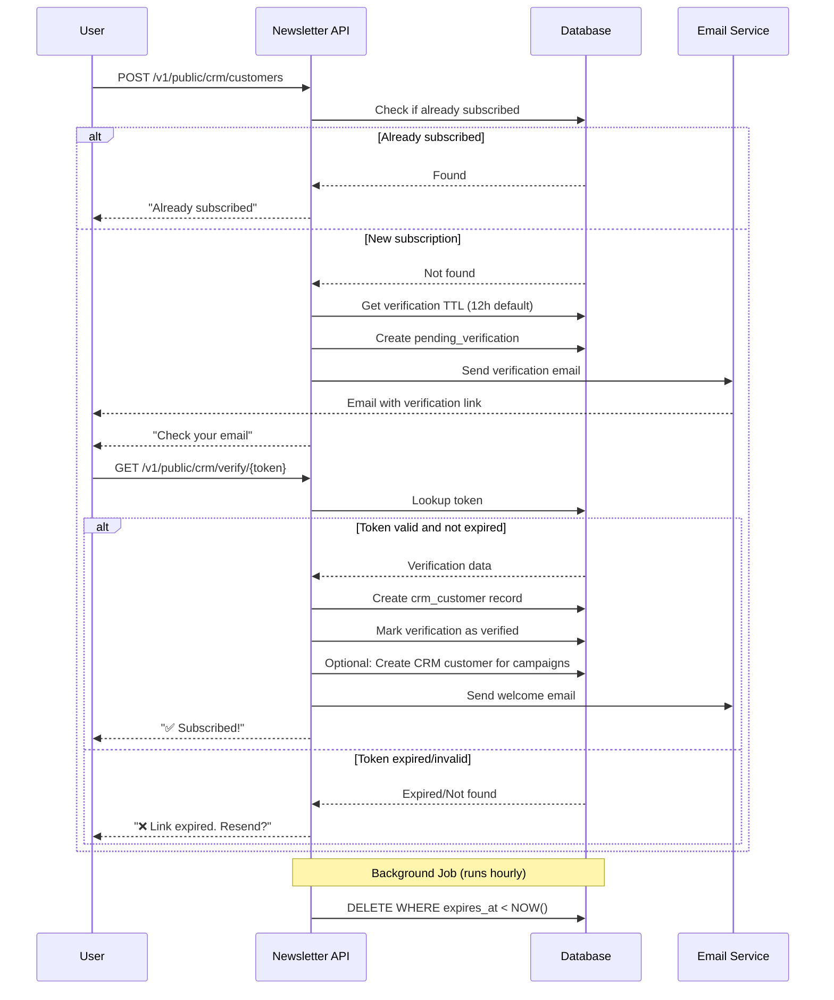

# FreeRadical CRM - Email Verification Flow

## Overview

FreeRadical CRM supports **double opt-in email verification** for public-facing customer creation. This prevents spam while enabling features like newsletter subscriptions, contact forms, and waitlist signups.

---

## Verification Flow Diagram



---

## Key Endpoints

### Public Endpoints (No Authentication Required)

#### 1. Create Customer with Verification
```
POST /v1/public/crm/customers
```

**Request Body:**
```json
{
  "email": "user@example.com",
  "first_name": "John",
  "last_name": "Doe",
  "lifecycle_stage": "lead",
  "tags": ["newsletter_subscriber"],
  "source": "website_signup"
}
```

**Response:**
```json
{
  "message": "Verification email sent. Please check your inbox.",
  "expires_in_hours": 12
}
```

#### 2. Verify Email Token
```
GET /v1/public/crm/verify/{token}
```

**Response:** HTML success page or error message

---

## Configuration

### TTL (Time To Live) Settings

Default: **12 hours**

Administrators can configure per tenant:
```sql
INSERT INTO verification_settings (tenant_id, verification_type, ttl_hours)
VALUES (1, 'crm_customer', 24);  -- 24 hours for tenant 1
```

### Global Defaults
```sql
UPDATE verification_settings 
SET ttl_hours = 12 
WHERE tenant_id IS NULL AND verification_type = 'crm_customer';
```

---

## Security Features

✅ **Email Validation** - Strict format checking  
✅ **Rate Limiting** - Max 5 requests/IP/hour  
✅ **Secure Tokens** - UUID + 32 random characters  
✅ **One-Time Use** - Tokens invalidated after verification  
✅ **Auto-Expiration** - Unverified records deleted after TTL  
✅ **Tenant Isolation** - Multi-tenant data separation  

---

## Newsletter Integration

Newsletter subscribers are stored as CRM customers with the `newsletter_subscriber` tag.

**Create Newsletter Segment:**
```sql
INSERT INTO crm_segments (name, criteria, tenant_id)
VALUES ('Newsletter Subscribers', '{"tags": ["newsletter_subscriber"]}', 1);
```

**Send Campaign:**
Use existing `/v1/api/crm/campaigns` endpoint targeting the newsletter segment.

---

## Background Jobs

### Cleanup Job (Runs Hourly)

Automatically removes expired, unverified records:

```rust
EmailVerificationService::cleanup_expired(&pool).await
```

Deletes all records where:
- `expires_at < NOW()`
- `verified = false`

---

## Use Cases

1. **Newsletter Subscriptions** ✅  
   Users subscribe via website forms, verify email, receive campaigns

2. **Contact Forms** ✅  
   Verify email before processing form submission

3. **Waitlist Signups** ✅  
   Prevent bot spam on waitlist entries

4. **User Registration** ✅  
   Verify email before account activation

5. **Giveaway Entries** ✅  
   Ensure legitimate participant emails

---

## Frontend Example

```html
<form id="newsletter-form">
  <input type="email" name="email" placeholder="Your email" required>
  <input type="text" name="first_name" placeholder="Name" required>
  <button type="submit">Subscribe</button>
</form>

<script>
document.getElementById('newsletter-form').addEventListener('submit', async (e) => {
  e.preventDefault();
  const formData = new FormData(e.target);
  
  const response = await fetch('https://your-site.com/v1/public/crm/customers', {
    method: 'POST',
    headers: { 'Content-Type': 'application/json' },
    body: JSON.stringify({
      email: formData.get('email'),
      first_name: formData.get('first_name'),
      lifecycle_stage: 'lead',
      tags: ['newsletter_subscriber'],
      source: 'website_signup'
    })
  });
  
  const data = await response.json();
  if (response.ok) {
    alert('✅ ' + data.message);
  }
});
</script>
```

---

## Admin Features

### List Subscribers
```
GET /v1/api/crm/customers?tags=newsletter_subscriber&page=1
```

### Create Segment
```
POST /v1/api/crm/segments
{
  "name": "Newsletter Subscribers",
  "criteria": {"tags": ["newsletter_subscriber"]}
}
```

### Send Campaign
```
POST /v1/api/crm/campaigns
{
  "name": "Weekly Newsletter",
  "segment_id": 123,
  "content": "..."
}
```

---

## Database Schema

### pending_verifications
```sql
CREATE TABLE pending_verifications (
    id SERIAL PRIMARY KEY,
    uuid UUID UNIQUE NOT NULL,
    verification_type VARCHAR(50) NOT NULL,
    email VARCHAR(255) NOT NULL,
    verification_token VARCHAR(255) UNIQUE NOT NULL,
    payload JSONB NOT NULL,
    tenant_id INTEGER,
    verified BOOLEAN DEFAULT FALSE,
    expires_at TIMESTAMP NOT NULL,
    created_at TIMESTAMP DEFAULT NOW(),
    verified_at TIMESTAMP
);
```

### verification_settings
```sql
CREATE TABLE verification_settings (
    id SERIAL PRIMARY KEY,
    tenant_id INTEGER,
    verification_type VARCHAR(50) NOT NULL,
    ttl_hours INTEGER DEFAULT 12,
    enabled BOOLEAN DEFAULT TRUE
);
```

---

## API Documentation

All endpoints are fully documented in Swagger UI:
- **Swagger UI:** `http://localhost:8000/swagger-ui/`
- **ReDoc:** `http://localhost:8000/redoc`

---

## Troubleshooting

### "Email not received"
- Check spam folder
- Verify email service configuration
- Check application logs for delivery errors

### "Token expired"
- Default TTL is 12 hours
- User can request new verification email
- Admin can increase TTL in settings

### "Already subscribed"
- Email already exists in CRM customers
- Check for duplicate submissions
- User can update preferences via admin panel

---

## Best Practices

1. **Set appropriate TTL** - Balance security vs. user convenience
2. **Customize email templates** - Match your brand
3. **Monitor verification rates** - Track successful vs. expired
4. **Clean up regularly** - Background job handles this automatically
5. **Rate limit aggressively** - Prevent abuse on public endpoints

---

For implementation details, see: [Email Verification Implementation Plan](file:///Users/prabhatsingh/.gemini/antigravity/brain/7d130e39-45a1-4a9d-b49b-f9546f4e9be0/newsletter_implementation_plan.md)
