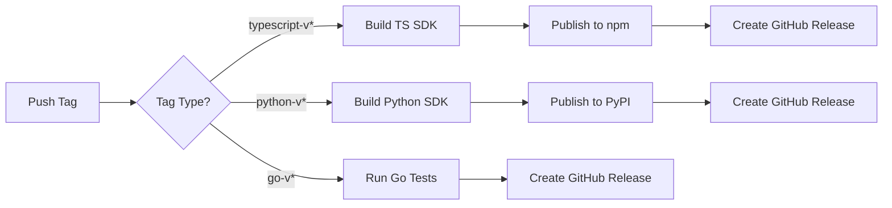

# GitHub Actions CI/CD Setup Guide

This guide shows you how to configure automated SDK publishing using GitHub Actions.

---

## ✅ What's Already Done

The GitHub Actions workflow is configured at:
**`.github/workflows/publish-sdks.yml`**

This workflow automatically publishes SDKs when you push version tags.

---

## 🔐 Step 1: Configure GitHub Secrets

You need to add two secrets to your GitHub repository:

### 1. NPM_TOKEN (for TypeScript SDK)

1. **Generate npm token:**
   ```bash
   npm login
   npm token create
   ```
   Copy the token (starts with `npm_...`)

2. **Add to GitHub:**
   - Go to: `https://github.com/cyberiums/freeradical/settings/secrets/actions`
   - Click **"New repository secret"**
   - Name: `NPM_TOKEN`
   - Value: Paste your npm token
   - Click **"Add secret"**

### 2. PYPI_TOKEN (for Python SDK)

1. **Get PyPI API token:**
   - Visit: https://pypi.org/manage/account/token/
   - Click **"Add API token"**
   - Scope: **"Entire account"** or specific to `freeradical-client`
   - Copy the token (starts with `pypi-...`)

2. **Add to GitHub:**
   - Go to: `https://github.com/cyberiums/freeradical/settings/secrets/actions`
   - Click **"New repository secret"**
   - Name: `PYPI_TOKEN`
   - Value: Paste your PyPI token
   - Click **"Add secret"**

**Note**: Go SDK doesn't need a token (published via git tags)

---

## 🚀 Step 2: Trigger Automated Publishing

Once secrets are configured, publishing is **fully automated**:

### Publish TypeScript SDK

```bash
git tag typescript-v0.7.0
git push origin typescript-v0.7.0
```

This will:
1. ✅ Trigger GitHub Actions workflow
2. ✅ Install dependencies
3. ✅ Build the SDK
4. ✅ Publish to npm
5. ✅ Create GitHub release

### Publish Python SDK

```bash
git tag python-v1.0.0
git push origin python-v1.0.0
```

This will:
1. ✅ Trigger GitHub Actions workflow
2. ✅ Build wheel and source distributions
3. ✅ Publish to PyPI
4. ✅ Create GitHub release

### Publish Go SDK

```bash
git tag go-v1.0.0
git push origin go-v1.0.0
```

This will:
1. ✅ Trigger GitHub Actions workflow
2. ✅ Run tests
3. ✅ Create GitHub release
4. ✅ Users can install via: `go get github.com/cyberiums/freeradical-go-client@go-v1.0.0`

---

## 📊 Step 3: Monitor Publishing

### View Workflow Runs

1. Go to: `https://github.com/cyberiums/freeradical/actions`
2. Click on the **"Publish SDKs"** workflow
3. See status of each SDK publication

### Check Logs

If a publication fails:
1. Click on the failed workflow run
2. Expand the failed job
3. Review error messages
4. Fix the issue and re-tag

---

## 🔄 Publishing Workflow



---

## 🛠️ Troubleshooting

### "NPM_TOKEN secret not found"

**Solution**: Make sure you added `NPM_TOKEN` in repository secrets (Step 1)

### "PyPI upload failed: 403 Forbidden"

**Solution**: 
1. Check `PYPI_TOKEN` is correct
2. Ensure token has permissions for `freeradical-client`
3. Verify package name isn't already taken

### "Workflow not triggering"

**Solution**:
1. Ensure tag format is correct: `typescript-v*`, `python-v*`, or `go-v*`
2. Check `.github/workflows/publish-sdks.yml` exists
3. Verify you pushed the tag: `git push origin <tag-name>`

---

## 📋 Quick Reference

| Action | Command |
|--------|---------|
| **Publish TypeScript** | `git tag typescript-v0.7.0 && git push origin typescript-v0.7.0` |
| **Publish Python** | `git tag python-v1.0.0 && git push origin python-v1.0.0` |
| **Publish Go** | `git tag go-v1.0.0 && git push origin go-v1.0.0` |
| **View Workflows** | `https://github.com/cyberiums/freeradical/actions` |
| **Manage Secrets** | `https://github.com/cyberiums/freeradical/settings/secrets/actions` |

---

## ✨ Benefits of CI/CD

- **Automated**: No manual npm/twine commands
- **Consistent**: Same process every time
- **Fast**: Publishes in ~2-3 minutes
- **Traceable**: Full logs in GitHub Actions
- **Reversible**: Can re-run if needed

---

## 🎯 Next Steps

1. ✅ Add `NPM_TOKEN` secret
2. ✅ Add `PYPI_TOKEN` secret
3. ✅ Test with one SDK (recommend Python first)
4. ✅ Monitor workflow run
5. ✅ Verify package published successfully

**Once configured, SDK publishing is just one command away!** 🚀
